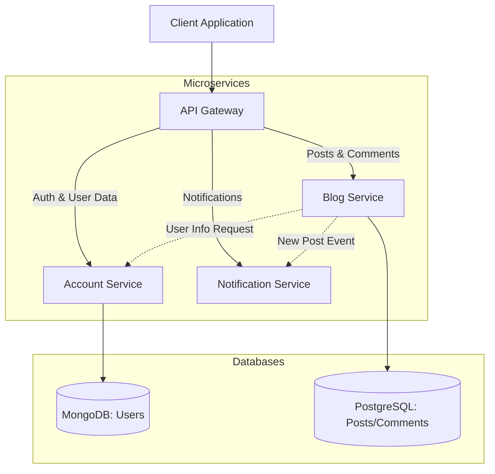

# Specification - Readme Project

## Microservice Architecture

Based on the technical requirements, the application is divided into the following microservices:

### 1. Account Service (`account`)
**Responsibilities:**
- User Registration and Authentication (JWT).
- User Profile Management (CRUD).
- Password Management (Hashing, Change).
- User Subscriptions (Follow/Unfollow).

**Database:**
- MongoDB (Suitable for flexible user profiles and subscriptions).

### 2. Blog Service (`blog`)
**Responsibilities:**
- Blog Post Management (CRUD for Video, Text, Quote, Photo, Link).
- Comments Management.
- Likes Management.
- Tags Management.
- Feed Generation (Aggregation of posts from subscriptions).
- Repost Logic.

**Database:**
- PostgreSQL (Suitable for structured data like posts, comments, and relational queries for feed/likes).

### 3. Notification Service (`notify`)
**Responsibilities:**
- Email Notifications (New posts).

**Database:**
- Not strictly required, but might use a small DB (e.g., MongoDB or Redis) for queuing or logging sent emails if needed. For now, stateless.

### 4. API Gateway (`api-gateway`)
**Responsibilities:**
- Entry point for the frontend.
- Request Routing.
- Authentication Middleware (validating JWT).
- Response Aggregation (e.g., combining Post data from `blog` with User data from `account`).

## Architecture Diagram

## Communication
- **Synchronous (HTTP/REST):** API Gateway <-> Services.
- **Asynchronous (RabbitMQ/Kafka - Optional/Future):** For notifications and potentially for cross-service events (e.g. "New Post" -> "Notify"). For the start, we might use direct HTTP calls or NestJS Microservices (TCP/RMQ).

## Tech Stack
- **Language:** TypeScript
- **Framework:** Nest.js
- **Monorepo:** NX
- **Databases:** MongoDB, PostgreSQL

---

## Подробная документация

Для детального описания архитектуры, включая ASCII-диаграммы, схемы баз данных и протоколы взаимодействия, смотрите файл [architecture-diagram.md](file:///d:/web/web-nest-readme/architecture-diagram.md).

**Примечание**: Для создания визуальной версии диаграммы (PNG/SVG) можно использовать:
- [Excalidraw](https://excalidraw.com) - сохранить как `.excalidraw` + экспорт в PNG
- [Draw.io](https://app.diagrams.net) - сохранить как `.drawio` + экспорт в PNG  
- [Mermaid Live](https://mermaid.live) - вставить код выше и экспортировать

